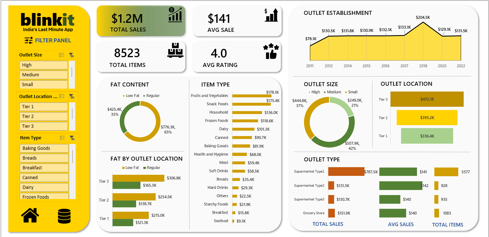
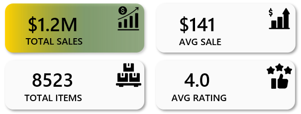
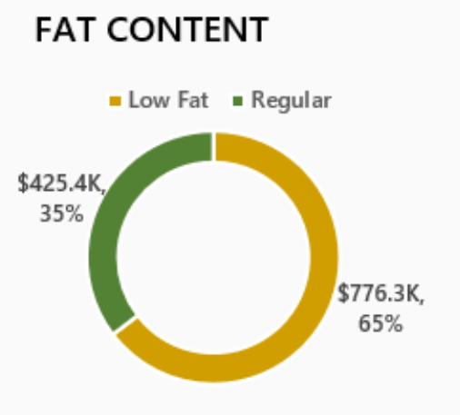
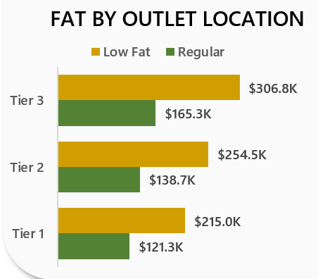
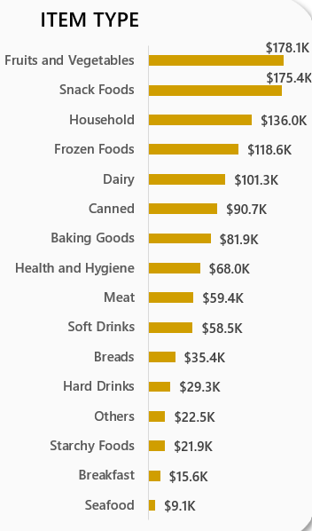
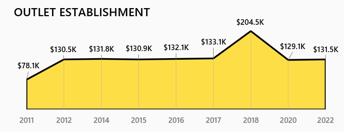
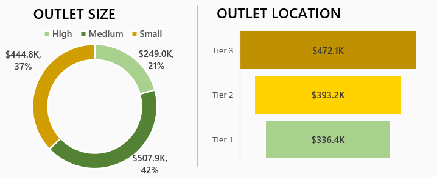

# 📦 Blinkit Dataset Analysis - Excel Dashboard

This project is a deep-dive Excel dashboard built on top of a retail dataset with over **8.5K records**, designed to explore trends and generate data-driven decisions using interactive visualizations and key business metrics.

---

## 📊 Dataset Overview

- **Records:** 8,500+
- **Columns:**
  - `Item Fat Content`, `Item Identifier`, `Item Type`
  - `Outlet Establishment Year`, `Outlet Identifier`
  - `Outlet Location Type`, `Outlet Size`, `Outlet Type`
  - `Item Visibility`, `Item Weight`, `Sales`, `Rating`

---

## 🎯 Insights Targeted

This project focuses on extracting business-critical insights from the Blinkit dataset to support retail decision-making. Key questions explored include:

- 🥫 Which **item types** generate the highest total sales?
- 🧈 How does **fat content** influence purchasing patterns?
- 🏬 What is the relationship between **outlet location/type** and sales performance?
- 📈 How do **outlet size** and **establishment year** impact overall revenue?
- 🌍 Which **regions (Tier 1/2/3)** drive the most sales volume?

These insights help identify profitable product categories, optimal store formats, and market trends that can guide strategic decisions.

---

## 🛠️ Tools & Skills Used

- Data Cleaning
- Pivot Tables & Pivot Charts
- Slicers & Navigation Buttons
- Dashboard Design (Excel)
- KPI Calculation
- Visual Storytelling

---

## 📌 KPI's Dashboard

> ✅ This top-level KPI section gives decision-makers an instant health check of the business.

---

## 🥩 Total Sales by Fat Content

**🔍 Insights:**
- **Low Fat items** significantly outsell Regular items.
- Health-focused products may be a growth segment to prioritize.

---

## 🏪 Sales by Fat Content & Outlet Location Type

**🔍 Insights:**
- Sales for **Low Fat items** outperform across all tiers.
- Indicates growing health-conscious buying behavior, especially in Tier 3 cities.

---

## 🥫 Total Sales by Item Type

**🔍 Insights:**
- **Fresh produce and snacks** dominate.
- Diversification into high-volume everyday items could boost sales further.

---

## 🏢 Sales by Outlet Establishment Year

**🔍 Insights:**
- Outlets established in **2018** saw the **highest performance**.
- Possibly due to location, better store format, or newer inventory systems.

---

## 🧱 Sales by Outlet Size & Location Type

**🔍 Insights:**
- **Medium-sized outlets** perform best.
- They might balance cost-efficiency with enough product range.
- Tier 3 locations show higher sales—likely due to lower competition or rising demand in semi-urban markets.

---

## 🛒 Key Metrics by Outlet Type

### 📈 Total Sales

| Outlet Type         | Sales     |
|---------------------|-----------|
| Supermarket Type1   | ₹787.5K   |
| Grocery Store       | ₹151.9K   |
| Supermarket Type2   | ₹131.5K   |
| Supermarket Type3   | ₹130.7K   |

### 📉 Average Sales

| Outlet Type         | Avg. Sale |
|---------------------|-----------|
| Supermarket Type2   | ₹142      |
| Supermarket Type1   | ₹141      |
| Grocery Store       | ₹140      |

### 📦 Total Items Sold

| Outlet Type         | Items     |
|---------------------|-----------|
| Supermarket Type1   | 5,577     |
| Grocery Store       | 1,083     |

**🔍 Insights:**
- **Supermarket Type1** is the leading format in both revenue and volume.
- **Grocery stores** still maintain solid performance in items sold.

---

## 📌 Summary & Recommendations

- 📈 **Low Fat and Fresh Items** dominate sales — healthy living trend is key.
- 🧠 **Mid-size stores** in **Tier 3 locations** perform best — consider replicating this model.
- 🧾 Use these insights to strategize product placement, outlet expansion, and customer targeting.

---

## 📂 Project Files

- 📄 [Full Dashboard](./Blinkit20%Analysis20%Dashboard.xslx)
 - Main dashboard file with slicers and visuals.

---

